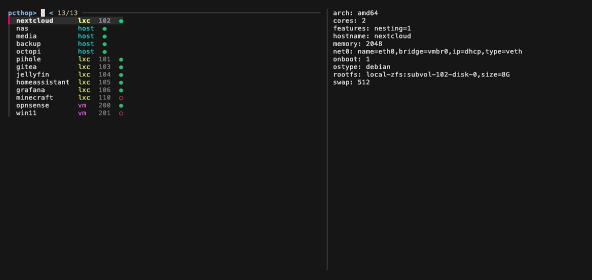

# pcthop

Fuzzy-pick a Proxmox LXC container, a VM, or a plain SSH host — and hop
straight into it.



- **One list**: SSH hosts (with live ●/○ reachability) and Proxmox guests,
  all discovered in parallel, so startup stays fast even with many hosts.
- **Frecency**: the entries you pick most float to the top (like `nextcloud`
  above), so your daily driver is usually just `pcthop` + enter.
- Narrow terminal? The preview automatically drops below the list instead of
  squeezing it ([screenshot](assets/pcthop-narrow.png)).

## Demo


One command, one list: your servers (from `~/.ssh/config` aliases) and your
Proxmox guests (discovered live from the node), fuzzy-searchable together.
Hit enter — you're in a root shell inside the container, or an SSH session on
the host. No agents, no API tokens, no sshd needed *inside* the containers:
it rides your existing SSH access and uses `pct enter` on the other side.

Run it on a bastion/jump host with `-l` (loop mode) and it becomes a
full-screen gateway: every session you exit drops you back into the picker.

## Why

If you run a Proxmox homelab you probably type this a lot:

```
ssh mynode
pct list          # ...what was the vmid again?
pct enter 162
```

`pcthop` collapses that into one fuzzy-searchable step, across as many nodes
as you have.

## Install

Needs [`fzf`](https://github.com/junegunn/fzf) **≥ 0.27** (for the adaptive
preview layout) and SSH access (as root or a `pct`/`qm`-capable user) to your
Proxmox node(s).

```bash
curl -fsSL https://raw.githubusercontent.com/ijoshi129/pcthop/main/pcthop \
  -o /usr/local/bin/pcthop && chmod +x /usr/local/bin/pcthop
```

(Or clone the repo and symlink `pcthop` anywhere on your `PATH`.)

## Usage

```bash
pcthop mynode                 # one node
pcthop mynode1 mynode2        # cluster / several nodes, merged into one list
pcthop -c mynode              # containers only
pcthop -m mynode              # VMs only
pcthop -s                     # SSH hosts only
pcthop -l                     # loop/gateway mode: back to the picker on exit
pcthop -L                     # print the list and exit (no picker)
pcthop --no-probe             # skip the SSH-host reachability check
```

Skip typing the node every time with `~/.config/pcthop/hosts`:

```ini
[nodes]     # Proxmox nodes — guests discovered live via pct/qm list
mynode

[ssh]       # plain SSH hosts (aliases from your ~/.ssh/config)
nas
media
```

then just run `pcthop`. The old one-node-per-line format still works (lines
before any section header count as `[nodes]`), as do env vars: `PCTHOP_HOSTS`
(nodes) and `PCTHOP_SSH_HOSTS`, space-separated.

Pick history lives in `~/.cache/pcthop/history` (delete it to reset the
frecency ordering).

Inside the picker: type to filter, **enter** to hop in, **esc** to quit. The
preview pane shows the guest's config (`pct config` / `qm config`) or, for
SSH hosts, the resolved connection details (`ssh -G`). Picking a stopped
guest offers to start it first.

## Notes

- **Containers** attach via `pct enter` — works even if the container has no
  network or no sshd. Exit the shell normally (`exit` / Ctrl+D).
- **VMs** attach via `qm terminal`, which needs a serial console on the VM
  (`qm set <vmid> -serial0 socket`, plus a getty on `ttyS0` in the guest).
  Exit with **Ctrl+O**. No serial console? You'll get an error from Proxmox,
  not a hang.
- Node aliases come straight from your `~/.ssh/config`, so keys, users,
  jump hosts, etc. all work as usual.
- Unreachable nodes are skipped with a warning, so one dead node doesn't
  break the list.

## License

[MIT](LICENSE)
